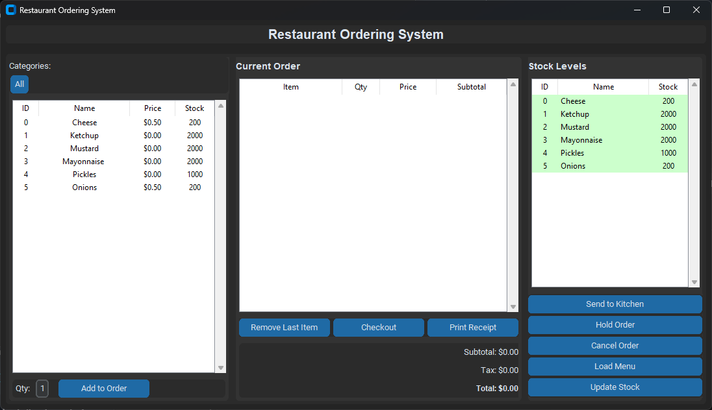

# Restaurant Ordering System
### SDEV_220_Final_Project_Group2

Course project: loads a text "database" of menu items and gives you a basic ordering GUI.



This version of the application uses the CustomTkinter python library, you can find the documentation and more information about CustomTkinter here: https://customtkinter.tomschimansky.com/
View the Github page here: https://github.com/tomschimansky/customtkinter

## Install CustomTkinter library with pip:

```powershell
pip install customtkinter
```

### Update existing installation

```powershell
pip install customtkinter --upgrade
```

## Run the GUI

```powershell
cd "C:\path\to\the\main"
python main.py
```

## Quick test CLI mode

```powershell
python main.py --cli
```

## If stuff breaks

- `ModuleNotFoundError: gui.restaurant_app` -> you probably ran it from the wrong folder. `cd` into the directory with the main.py file.
- Tkinter missing? Re‑install Python from python.org (standard installer includes Tk). On Windows Store versions it can be flaky.
- Nothing loads? Check the `SDEV_220_Final_Project_Group2/DatabaseFiles` folder still has `default.txt` and `default_addons.txt`.

## What's here

- `main.py` – launcher (GUI by default, CLI with `--cli`).
- `gui/restaurant_app.py` – the Tkinter interface.
- `models/` – inventory + product/addon + order classes.
- `SDEV_220_Final_Project_Group2/DatabaseFiles/` – the text data files.
