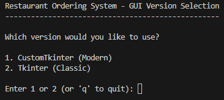
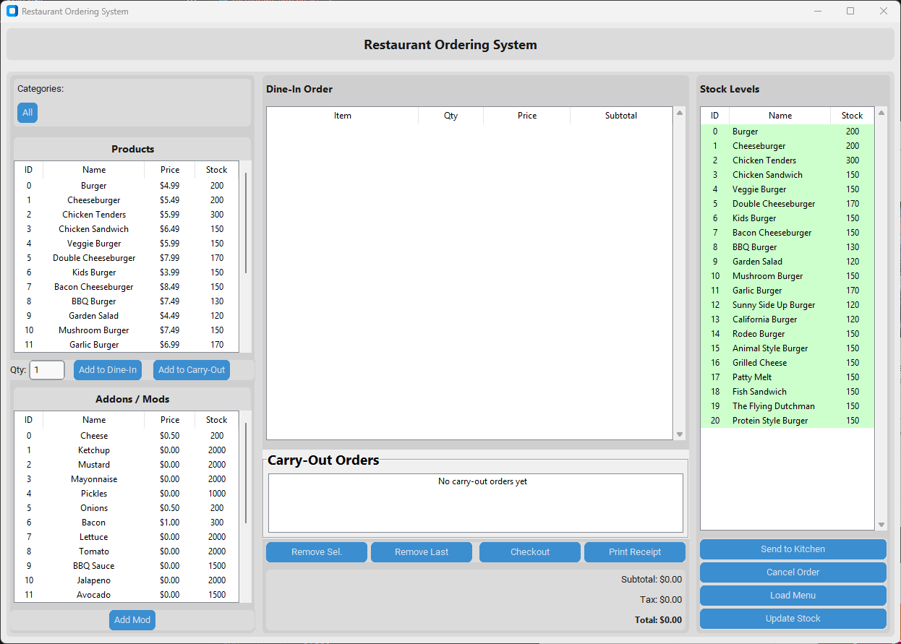
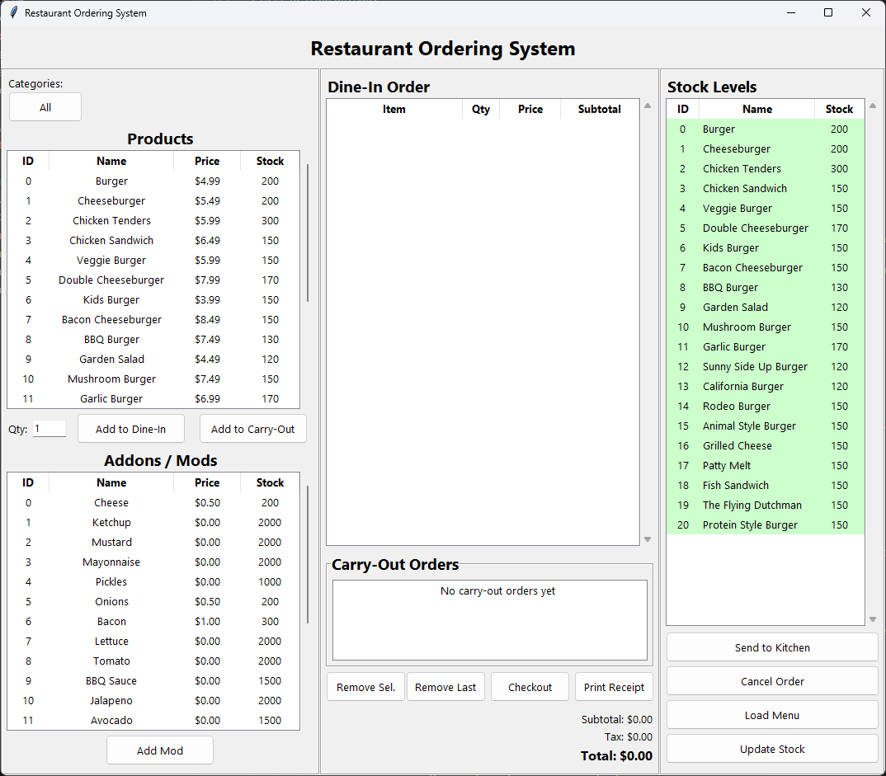

# Restaurant Ordering System
### SDEV_220_Final_Project_Group2

Course project: This program loads a text "database" of menu items and gives you a basic ordering GUI. You can choose between the modern GUI that uses CustomTkinter or the classic GUI that uses Tkinter.




To use the CustomTkinter version of the application you must install the CustomTkinter python library. Installation instructions can be found below:

## Install CustomTkinter library with pip:

```powershell
pip install customtkinter
```

### Update existing installation

```powershell
pip install customtkinter --upgrade
```

View the documentation and more information about CustomTkinter here: https://customtkinter.tomschimansky.com/

View the Github page here: https://github.com/tomschimansky/customtkinter

If Customtkinter is not installed or does not run properly, the application will attempt to run using the default tkinter library.

Light Mode


Dark Mode


tkinter version


## Run the GUI

```powershell
cd "C:\path\to\the\main"
python main.py
```

## Quick test CLI mode

```powershell
python main.py --cli
```
## Run Tkinter version

```powershell
python main.py --tk
```
## Run CustomTkinter version

```powershell
python main.py --ctk
```

## If stuff breaks

- `ModuleNotFoundError: gui.restaurant_app` -> you probably ran it from the wrong folder. `cd` into the directory with the main.py file.
- Tkinter missing? Re‑install Python from python.org (standard installer includes Tk). On Windows Store versions it can be flaky.
- Nothing loads? Check the `SDEV_220_Final_Project_Group2/DatabaseFiles` folder still has `default.txt` and `default_addons.txt`.

## What's here

- `main.py` – launcher (GUI by default, CLI with `--cli`).
- `gui/restaurant_app.py` – the Tkinter interface.
- `gui/custom_tkinter_restaurant_app.py` – the Customtkinter interface.
- `restaraunt_systems` – inventoryhandler + product/addon classes.
- `SDEV_220_Final_Project_Group2/DatabaseFiles/` – the text data files.
